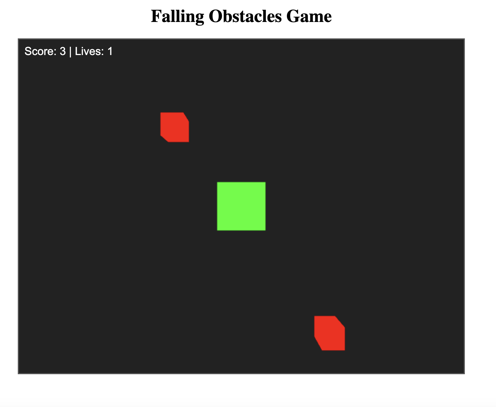
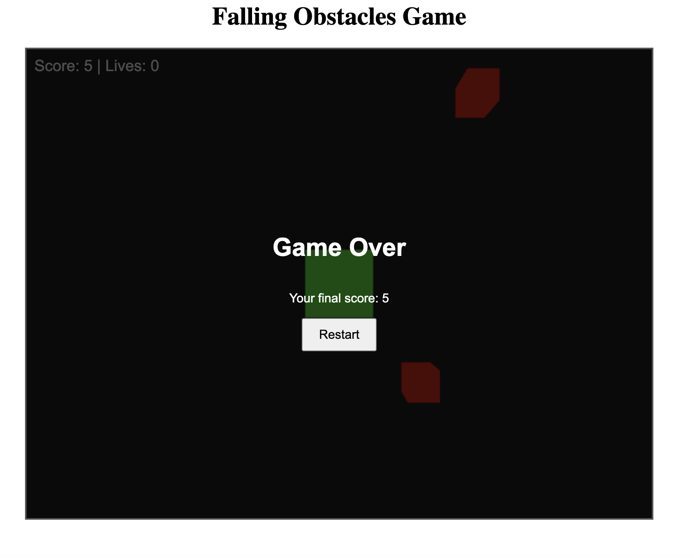

# Obstacle Outrun

This is a simple, engaging 3D game built with Three.js, Vite, React, and TypeScript. In the game, you control a green cube that moves left and right within a fixed game area. Red obstacles fall from above, and you must dodge them to avoid collisions. You have three lives, and your score increases each time an obstacle successfully passes off-screen. The game ends when all lives are lost, with an option to restart. I created this game to try out `Three.js` for interactive gameplay as I never designed game before.

## Running the game locally
- node version 18 or higher is needed
- Run `npm ci`
- Run `npm run dev`
- Enjoy!

## Preview

